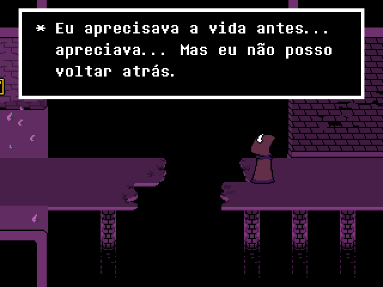
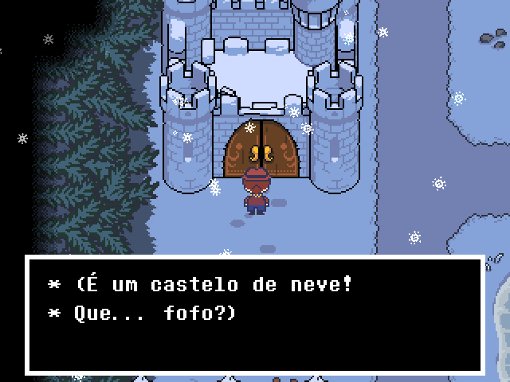
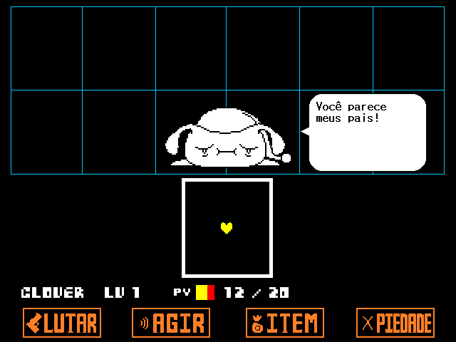
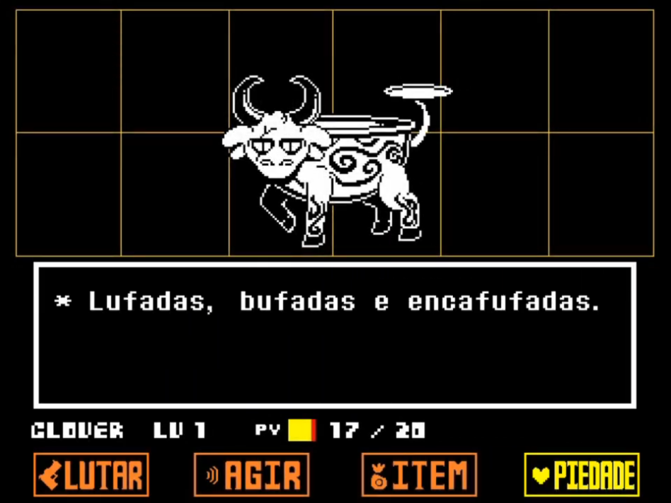
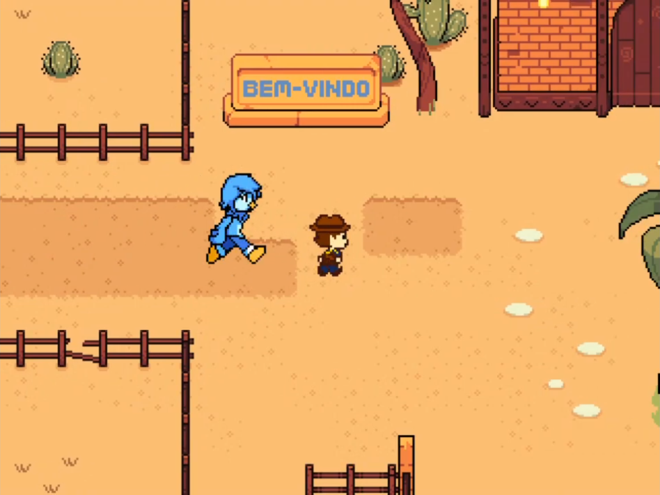
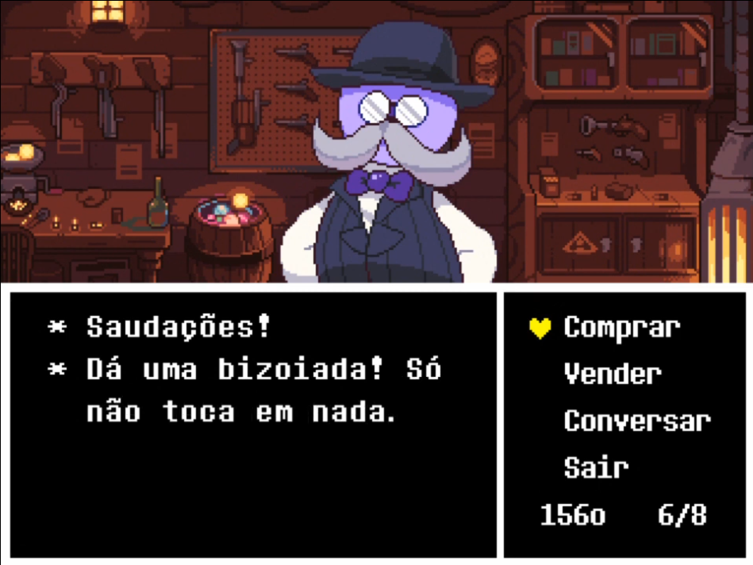

  <h1>Tradução PT-BR de Undertale Yellow</h1>
  Uma tradução brasileira feita pela <a href="https://github.com/TEIARRUMA">TEIARRUMA</a> de <a href="https://gamejolt.com/games/UndertaleYellow/136925">Undertale Yellow</a>, jogo feito por <a href="https://gamejolt.com/@TeamUTY">Team Undertale Yellow</a>.

## Links
### 🖥️ [Baixar Tradução](https://github.com/teiarruma/undertale-yellow-ptbr/releases/latest)

O link te redirecionará à nossa publicação mais recente da tradução. Lá você encontrará um arquivo ZIP que contém o jogo e a tradução. **É só baixar, extrair e começar a jogar!**

Não entendeu bem como instalar? Experimente seguir [nosso tutorial](https://youtu.be/3OjrcnpaCAw)!

### [📞 Entrar no nosso Discord](https://discord.gg/7DtZ7E4yYG)

Com dúvidas na instalação? Quer reportar erros? Entre no nosso servidor Discord!

### [📁 Saves compatíveis](https://drive.google.com/drive/folders/1GzOQpLQMj_PJPtG6hToEiGZJrXrUTuiS?usp=sharing)

Se você jogou a demo, saiba que, assim como no jogo original em inglês, o save da demo não é compatível com o jogo completo. Além disso, para jogar do zero, você deve limpar a sua pasta de save para o jogo ser executado corretamente.

Jogar em português usando saves criados em uma jogatina em inglês pode e vai causar bugs por conta de como dados de inventário, inimigos e lugares são salvos no arquivo de save.

**Não quer jogar do zero** ou **quer jogar a partir de um save**? Organizamos e fornecemos saves das rotas jogadas em português em uma [pasta no Google Drive](https://drive.google.com/drive/folders/1GzOQpLQMj_PJPtG6hToEiGZJrXrUTuiS?usp=sharing)!

## Jogo completo? Havia como contribuir?

Estávamos com vagas abertas para interessados em trabalhar conosco na tradução do jogo completo.

A permissão de entrada exigia conversa para avaliar as habilidades da pessoa e, assim, descobrir quais tarefas ela poderia desempenhar. Com isso, decidíamos se era aceita no projeto de tradução após uma fase de tradução supervisionada.

Bastava entrar no [nosso servidor no Discord](https://discord.gg/7DtZ7E4yYG) e demonstrar seu interesse no canal <i>candidate-se</i> para que pudéssemos conversar.

Agora após o lançamento da tradução do jogo todo, só abriremos vagas na equipe novamente em algum futuro projeto, como Deltarune ch3&4. Fique de olho se quiser participar!

## Capturas de Tela

 
 
 
 
 
 

## Créditos (Completo)

- **marCeL099** - Gestão / Tradução Principal / Revisão / Sprites / Programação
- **Detoria** - Tradução Casual / Programação
- **Kalleu11** - Tradução Casual / Sprites / Fontes
- **valterjogando** - Tradução Casual / Playtesting
- **EnzuhhhhBR** - Tradução Casual
- **Eliandro** - Tradução Principal / Sprites / Playtesting / Programação
- **Odinsdottir** - Tradução Principal / Revisão / Playtesting
- **odeioabacate (Dan)** - Tradução Principal / Sprites / Playtesting
- **Nicolas_mcfly** - Tradução Principal / Playtesting
- **Refri** - Sprites / Playtesting
- **Jinjo** - Tradução Casual / Playtesting
- **Dilio** - Tradução Casual
- **AnneAGES** - Tradução Casual
- **Akira** - Tradução Casual / Sprites
- **Caçador Eterno** - Sprites

## Créditos (Demo)

- **marCeL099** - Tradução / Revisão / Coordenação
- **Detoria** - Tradução / Revisão / Programação / Sprites / Coordenação
- **Kalleu11** - Tradução / Revisão / 🐐
- **Nexon** - Tradução
- **refri** - Sprites
